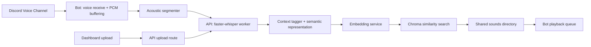

# Architecture

This document is the main technical reference for the monorepo.

## System Overview

## Component Boundaries
- `bot`
  - joins and leaves Discord voice channels
  - captures PCM audio per speaker
  - closes acoustic segments with silence/min/max/grace rules
  - sends WAV segments to the API
  - plays matched MP3 files through a FIFO queue
- `api`
  - owns transcription, context tagging, embedding generation, catalog persistence, and vector search
  - hosts the long-lived Python worker so Whisper is loaded once
  - maintains a short-lived semantic pending buffer per `guildId:speakerId`
- `dashboard`
  - uploads MP3 files to the API
  - lists indexed meme sounds from the persisted catalog
- `sounds/`
  - runtime storage for uploaded meme audio

## Key Design Decisions
- The ML pipeline is API-centric to avoid loading Whisper more than once.
- The bot only performs acoustic segmentation, not semantic search.
- Semantic coherence is improved with a pending merge layer in the API after transcription.
- Chroma uses full semantic documents for retrieval and scalar/boolean metadata for filtering.

## Data Flow
1. A user runs `/join`.
2. The bot connects with `selfDeaf: false` and begins listening to speakers.
3. PCM audio is buffered per speaker until silence or max/grace rules close a segment.
4. The bot wraps the PCM buffer as WAV and sends it to `POST /api/v1/segments`.
5. The API transcribes the audio, optionally merges it with a recent pending segment, enriches it with contextual tags, and generates an embedding.
6. Chroma returns nearest indexed meme sounds.
7. The API only returns `matched` when the normalized similarity exceeds `SIMILARITY_THRESHOLD`.
8. The bot enqueues the returned MP3 into the guild playback queue.

## Persistence
- `sounds/`: uploaded MP3 files
- `data/sounds.json`: lightweight catalog used for dashboard listing and ID lookup
- `data/chroma/`: local Chroma database files
- `data/transformers-cache/`: Transformers.js model cache

## Shared Contracts
- `SoundRecord`: persisted indexed sound metadata
- `SegmentResponse`: `pending`, `no_match`, or `matched`

## Known Constraints
- Discord audio receive is less stable than playback and depends on Discord voice behavior.
- Chroma must run separately from the Node processes.
- The current semantic merge strategy merges transcripts, not raw audio, for follow-up segments.
